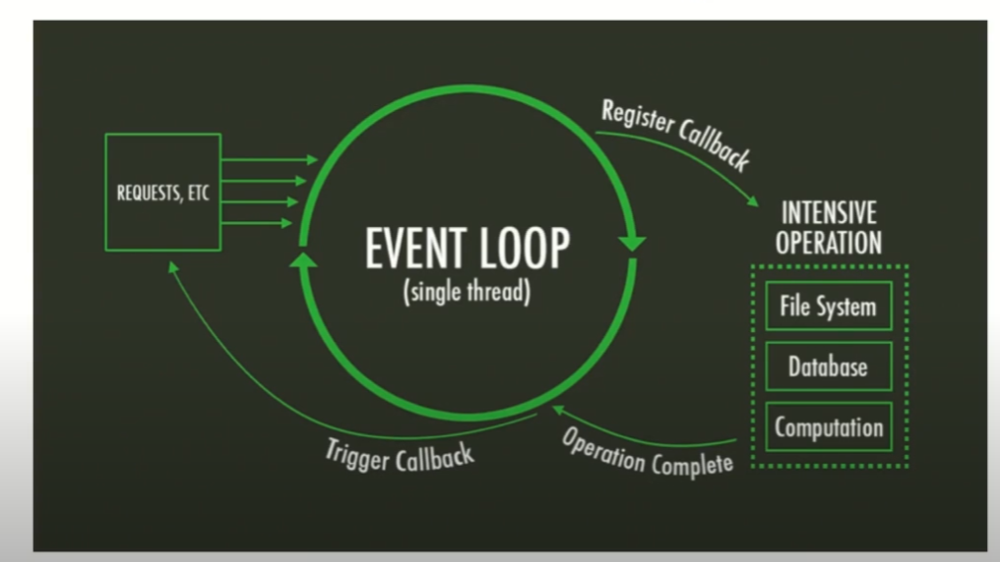

# Introdução ao NodeJs 
Este Projeto cria um servidor NodeJs que utiliza o framework Express para utilizar um json que simula (mock) um Banco de dados contendo informações de usuários.
- Fs é usado file management 
- path para lidar com pastas de arquivos
- fs.writeFileSync para escrita em arquivo 
- São construidas as rotas get, post , put e delete para o usuário com envio de status e mensagem
- As requisições são feitas através de body-parser que receber os parametros via x-www-form-encoded das requisições
- app é injetado no módulo UserRoute 

# Execução : 

- node index.js executa o servidor 

# Conteúdos  
Node JS é Js sendo executado do lado do servidor 

- 2009 por Ryan Dahl
- Js V8, Event Loop e a libuv 
- Event Driven 
- Event Loop 
- Assincronicidade 
- Processos IO não Bloqueantes 

- Resquest-> callback que é executado quando a req termina -> fila de execução  -> DB
- Event loop é Single Thread disponivel assim que terminar de registrar o callback 
- 

## Express : 

- Framework web rápido para nodeJs 
- recursos para Web e mobile 
- Métodos HTTP e middlewares 
- npm i
- npm install express --save  (saves to package.json)

## Rotas 

- vamos instalar o bodyparser para receber os parametros pelo post das  requisições  
/// dado do post para objeto
app.use(bodyParser.urlencoded({ extended : false}))
- x-www-form-encoded (requisicoes de form)